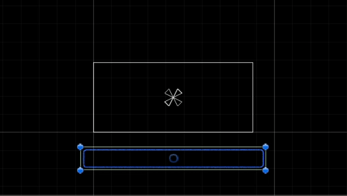
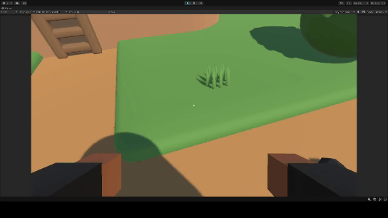
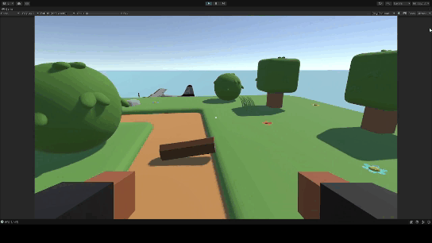
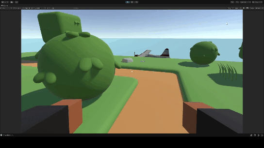
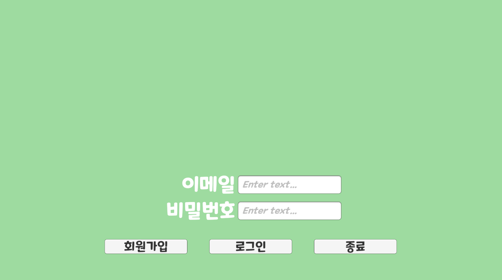
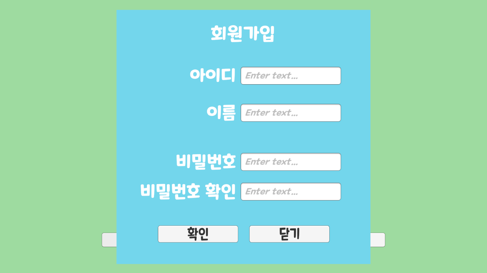
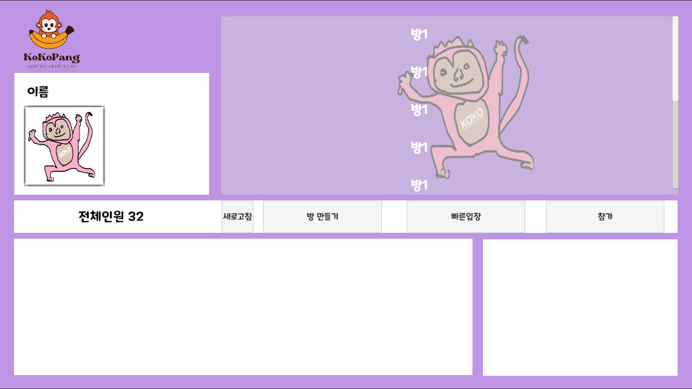
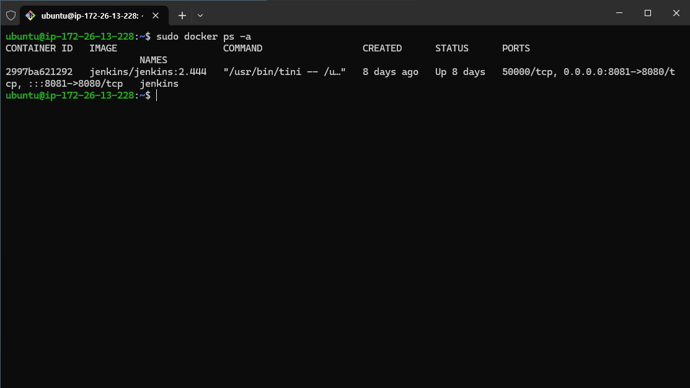
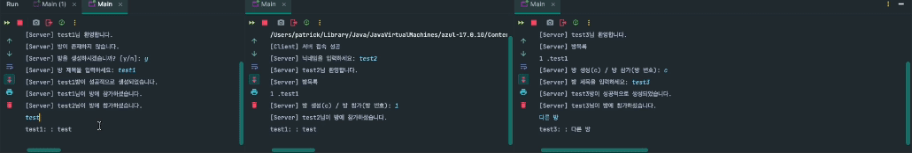

# C211

## 4주차 평가 목적 임시 README

| 이름  | 역할 | 진행 상황 | 관련 코드 및 폴더 |
|-------|---------|------------------|-----------|
| 강승원 | 클라이언트 | [강승원](#강승원) | [강승원]() |
| 김선욱 | 클라이언트 | [김선욱](#김선욱) | [김선욱](https://lab.ssafy.com/s10-metaverse-game-sub2/S10P22C211/-/tree/develop/Prototype?ref_type=heads) |
| 김영일 | 서버 및 데이터 | [김영일](#김영일) | [김영일]() |
| 이주현 | 서버 및 데이터 | [이주현](#이주현) | [이주현]() |
| 이항우 | 클라이언트, 서버, 데이터 및 CI/CD | [이항우](#이항우) | [이항우]() |
| 장동재 | 서버 및 데이터 | [장동재](#장동재) | [장동재]() |


# 강승원

## 메인 게임 UI 구현

## 게임 내 오브젝트 랜덤 생성 학습


- popup창이 켜지고 꺼지는 효과 만들기


```C#
using System;
using System.Collections;
using System.Collections.Generic;
using UnityEngine;
using UnityEngine.UI;


public class PopSys : MonoBehaviour
{
    public GameObject popup;
    Animator anim;
    public static PopSys Instance { get; private set; }

    Action onClickOkay, onClickCancel;

    private void Awake()
    {
        Instance = this;
        anim = popup.GetComponent<Animator>();
    }

    public void OpenPopUp(
        Action onClickOkay,
        Action onClickCancel)
    {
        //this를 적용해주지 않으면 위에 action에 할당된 변수가 지정됨
        this.onClickOkay = onClickOkay;
        this.onClickCancel = onClickCancel ;
        popup.SetActive(true);

    }


    public void OnClickOkay()
    {
        if (onClickOkay != null)
        {
            onClickOkay();
        }
        ClosePopup();
    }

    public void OnClickCancel()
    {
        if (onClickCancel != null)
        {
            onClickCancel();
        }
        ClosePopup();
    }

    void ClosePopup()
    {
        Debug.Log("이거는 popup값" + popup);
        Debug.Log("이거는 popup 오브젝트 값"+popup.gameObject);
        AnimatorStateInfo stateInfo = anim.GetCurrentAnimatorStateInfo(0);
        Debug.Log("Current Animator State: " + stateInfo.fullPathHash);
        anim.SetTrigger("close");
        popup.SetActive(false);

    }
}

```

- 로딩 페이지 기능 구현 및 페이지 이동


```C#
using System.Collections;
using System.Collections.Generic;
using UnityEngine;
using UnityEngine.UI;
using UnityEngine.SceneManagement;

public class Loading : MonoBehaviour
{
    static string nextScene;

    [SerializeField]
    Image progressBar;
    public static void LoadScene(string sceneName)
    {
        nextScene = sceneName;
        SceneManager.LoadScene("Map");
    }

    void Start()
    {
        StartCoroutine(LoadSceneProcess());

    }

    IEnumerator LoadSceneProcess()
    {
        AsyncOperation op = SceneManager.LoadSceneAsync(nextScene);
        op.allowSceneActivation = false;

        float timer = 0f;
        while (!op.isDone)
        {
            yield return null;
            if(op.progress<0.9f)
            {
                progressBar.fillAmount = op.progress;
            }
            else
            {
                timer += Time.unscaledDeltaTime;
                progressBar.fillAmount = Mathf.Lerp(0.9f,1f,timer);
                if(progressBar.fillAmount >= 1f )
                {
                    op.allowSceneActivation = true;
                    yield break;

                }
            }
        }
    }

    void Update()
    {
        
    }
}


```
- 메인맵 프로토 타입 제작


```txt
- 이동 거리 및 속도 고려
- 이동속도 대비 맵 스케일 고려
- 플레이어 점프에 따른 맵 층계 높이 고려

```

- 크레프팅 오브젝트 랜덤 생성 학습
```C#
using System.Collections;
using System.Collections.Generic;
using UnityEngine;

public class enemy : MonoBehaviour
{
    // 내 주변의 몬스터 찾기 알고리즘 구현
    [SerializeField] GameObject player;
    //Unity 게임 오브젝트를 그룹화 하고 동작을 수행하게 함
    [SerializeField] LayerMask layer;
    // 주변을 감지할 원의 범위 설정
    [SerializeField] float radius;
    // 원의 사이즈 안에 충돌하는게 있는지 확인
    [SerializeField] Collider[] col;

    [SerializeField] Transform target;


    [Header("적생성")]
    [SerializeField] GameObject Cenemy;
    [SerializeField] Transform[] Menemy;
    [SerializeField] float creatTime;


    //[Header("카운트")]
    //public int Count;
    //[SerializeField] Text TextCount;
    // Start is called before the first frame update
    private void Start()
    {
        InvokeRepeating("EnemyAround", 0, 0.2f);
        InvokeRepeating("EnemyCreate", 0, creatTime);
    }

    // 주변에 있는 적을 찾는것
    void EnemyAround()
    {
        col = Physics.OverlapSphere(player.transform.position, radius, layer);
        Transform minenemy = null;

        if (col.Length > 0)
        {
            float minDistance = Mathf.Infinity;

            foreach (Collider mCol in col)
            {
                float playerToDistance = Vector3.SqrMagnitude(player.transform.position - mCol.transform.position);
                if (playerToDistance < minDistance)
                {
                    minDistance = playerToDistance;
                    minenemy = mCol.transform;
                }
            }
        }
        target = minenemy;
    }


    void EnemyCreate()
    {
        int i = Random.Range(0,Menemy.Length);


        Instantiate(Cenemy, Menemy[i].position, Menemy[i].rotation);


    }

    private void Update()
    {
        // 주변에 타겟이 있는지 없는지 확인
        if (target == null)
        // 타겟이 없으면 빙글 빙글 돌아감
        {
            player.transform.Rotate(new Vector3(0, 60, 0) * Time.deltaTime);
        }
        else
        {
            // 적이 있으면 적이 있는 방향으로 몸을 돌림.
            Quaternion dir = Quaternion.LookRotation(target.position - player.transform.position);
           // 돌아가다가 그 적이 있는 방향으로 회전함
            Vector3 angle = Quaternion.RotateTowards(player.transform.rotation, dir, 200 * Time.deltaTime).eulerAngles;
            // 
            player.transform.rotation = Quaternion.Euler(0, angle.y, 0);
        
        }
    }

}


```
- 적대 오브젝트들이 플레이어 방향을 바라보기 및 이동 설정
```c#
using System.Collections;
using System.Collections.Generic;
using UnityEngine;

public class MonsterControl : MonoBehaviour
{
    [SerializeField] Collider[] col;
    [SerializeField] float radius;
    [SerializeField] LayerMask layer;
    [SerializeField] Transform target;


    // Start is called before the first frame update
    void Start()
    {
        InvokeRepeating("FindPlayer",0, 0.5f);
    }

    // Update is called once per frame
    void Update()
    {
        if (col.Length > 0)
        {
            Quaternion dir = Quaternion.LookRotation(transform.position - target.position);
            Vector3 angle = Quaternion.RotateTowards(transform.rotation, dir, 200*Time.deltaTime).eulerAngles;
            transform.rotation = Quaternion.Euler(0, angle.y, 0);

            transform.Translate(Vector3.back * Time.deltaTime);


        }
    }

    void FindPlayer()
    {
        col = Physics.OverlapSphere(transform.position, radius, layer);
        Transform TCol = null;
        if (col.Length > 0)
        {
            TCol = col[0].transform;

        }
        target = TCol;

    }

}
```

- 오브젝트 풀링 기본 코드 학습
```C#
using UnityEngine;
using System.Collections.Generic;

public class ObjectPool : MonoBehaviour
{
    public static ObjectPool Instance;

    public GameObject sushiPrefab;
    public int poolSize = 10;

    private List<GameObject> pooledObjects = new List<GameObject>();

    void Awake()
    {
        Instance = this;
    }

    void Start()
    {
        for (int i = 0; i < poolSize; i++)
        {
            GameObject obj = Instantiate(sushiPrefab);
            obj.SetActive(false);
            pooledObjects.Add(obj);
        }
    }

    public GameObject GetPooledObject()
    {
        for (int i = 0; i < pooledObjects.Count; i++)
        {
            if (!pooledObjects[i].activeInHierarchy)
            {
                return pooledObjects[i];
            }
        }

        return null;
    }
}

```

# 김선욱

## 메인 게임 기능 구현

### 1인칭 시점 기능 및 플레이어 움직임 구현



```C#
    // rigidbody를 통해 Player Control
    private Rigidbody myRigid;

    // Start is called before the first frame update
    void Start()
    {
        myRigid = GetComponent<Rigidbody>();
    }

    private void Move()
    {
        // A, D, Left, Right 키 입력 => 오른쪽 방향키 : 1, 왼쪽 방향키 : -1, 입력 X : 0 return
        float _moveDirX = Input.GetAxisRaw("Horizontal");
        // W, S, Up, Down 키 입력 => 위쪽 방향키 : 1, 아래쪽 방향키 : -1, 입력 X : 0 reutrn
        float _moveDirZ = Input.GetAxisRaw("Vertical");

        Vector3 _moveHorizontal = transform.right * _moveDirX;
        Vector3 _moveVertical = transform.forward * _moveDirZ;

        Vector3 _velocity = (_moveHorizontal + _moveVertical).normalized * applySpeed;

        myRigid.MovePosition(transform.position + _velocity * Time.deltaTime);
    }
```

- Horizontal, Vertical 입력을 통해 Vector3 값을 계산하고 포지션 변경을 통해 이동 구현
- Rigidbody를 통한 움직임 구현

```C#
    // 스피드 조정 변수
    [SerializeField]
    private float walkSpeed = 5.0f;
    [SerializeField]
    private float runSpeed = 7.0f;

    private float applySpeed;

    private void TryRun()
    {
        if (Input.GetKey(KeyCode.LeftShift))
        {
            Running();
        }
        if (Input.GetKeyUp(KeyCode.LeftShift))
        {
            RunningCancel();
        }
    }
    private void Running()
    {
        isRun = true;
        applySpeed = runSpeed;
    }
    private void RunningCancel()
    {
        isRun = false;
        applySpeed = walkSpeed;
    }
```

- 걷는 속도와 달리기 속도를 설정하여 LeftShift 버튼을 눌렀을 때 달리기 속도로 적용하여 달리는 효과 적용

```C#
    [SerializeField]
    private float jumpForce = 5.0f;

    private bool isGround = true;

    private void IsGround()
    {
        isGround = Physics.Raycast(transform.position, Vector3.down, capsuleCollider.bounds.extents.y + 0.1f);
    }
    private void TryJump()
    {
        if (Input.GetKeyDown(KeyCode.Space) && isGround)
        {
            Jump();
        }
    }
    private void Jump()
    {
        myRigid.velocity = transform.up * jumpForce;
    }
```

- RayCast를 통해 땅과 떨어짐을 판단 하여 점프 파워를 선언하고 점프 기능 구현

```C#
    [SerializeField]
    private float cameraRotationLimit;
    private float currentCameraRotationX;

    [SerializeField]
    private Camera theCamera;

    private void CameraRotation()
    {
        // 상하 카메라 회전
        float _xRotation = Input.GetAxisRaw("Mouse Y");
        float _cameraRotationX = _xRotation * lookSensitivity;
        currentCameraRotationX -= _cameraRotationX;
        // cameraRoatationLimit 범위 내에 가둠
        currentCameraRotationX = Mathf.Clamp(currentCameraRotationX, -cameraRotationLimit, cameraRotationLimit);

        theCamera.transform.localEulerAngles = new Vector3(currentCameraRotationX, 0f, 0f);
    }

    private void CharacterRotation()
    {
        // 좌우 캐릭터 회전
        float _yRotation = Input.GetAxisRaw("Mouse X") * lookSensitivity;
        Quaternion _deltaRotation = Quaternion.Euler(new Vector3(0f, _yRotation, 0f));
        myRigid.MoveRotation(myRigid.rotation * _deltaRotation);
    }
```

- 플레이어에 카메라를 상속 시켜 1인칭 시점 구현
- 마우스 움직임에 따라 X축과 Y축을 기준으로 상하좌우 회전을 구현
- 카메라 민감도를 설정 가능하도록 하고 상하 최대 각도 45도로 제한

```C#
using System.Collections;
using System.Collections.Generic;
using UnityEngine;

public class ArmsControl : MonoBehaviour
{
    // 현재 장착된 Arms형 타입 무기
    [SerializeField]
    private Arms currentArms;

    // 공격 중 상태
    private bool isAttack = false;
    private bool isSwing = false;

    private RaycastHit hitInfo;

    void Update()
    {
        TryAttack();   
    }

    private void TryAttack()
    {
        if (Input.GetButton("Fire1"))
        {
            if (!isAttack)
            {
                // 코루틴 실행
                StartCoroutine(AttackCouroutine()); 
            }
        }
    }

    IEnumerator AttackCouroutine()
    {
        isAttack = true;
        currentArms.anim.SetTrigger("Attack");

        yield return new WaitForSeconds(currentArms.attackDelayA);
        isSwing = true;

        // 공격 활성화 시점
        StartCoroutine(HitCoroutine());

        yield return new WaitForSeconds(currentArms.attackDelayB);
        isSwing = false;

        yield return new WaitForSeconds(currentArms.attackDelay - currentArms.attackDelayA - currentArms.attackDelayB);

        isAttack = false;
    }

    IEnumerator HitCoroutine()
    {
        while (isSwing)
        {
            if (CheckObject())
            {
                isSwing = false;
                // 충돌 됨
                Debug.Log(hitInfo.transform.name);
            }
            yield return null;
        }
    }

    private bool CheckObject()
    {
        if (Physics.Raycast(transform.position, transform.TransformDirection(Vector3.forward), out hitInfo, currentArms.range))
        {
            return true;
        }

        return false;
    }
}
```
- 팔 애니메이션 구현을 통해 도끼, 곡괭이 등 파밍 시스템 준비

### 인벤토리 기능 구현



```C#
using System.Collections;
using System.Collections.Generic;
using UnityEngine;

[CreateAssetMenu(fileName = "New Item", menuName = "New Item/item")]
public class Item : ScriptableObject
{
    // 아이템의 이름
    public string itemName;
    // 아이템의 설명
    [TextArea]
    public string itemDescription;
    // 아이템의 유형
    public ItemType itemType;
    // 아이템의 이미지
    public Sprite itemImage;
    // 아이템의 프리팹
    public GameObject itemPrefab;
    // 무기 유형
    public string weaponType;

    public enum ItemType
    {
        Equipment,
        Used,
        Ingredient,
        ETC
    }

}
```

- 아이템에 대하여 ScriptableObject로 선언하여 Create 하여 사용할 수 있도록 설정

```C#
    private void CanPickUp()
    {
        if (pickupActivated)
        {
            if (hitInfo.transform != null)
            {
                Debug.Log(hitInfo.transform.GetComponent<ItemPickup>().item.itemName + " 획득했습니다.");
                theInventory.AcquireItemd(hitInfo.transform.GetComponent<ItemPickup>().item);
                Destroy(hitInfo.transform.gameObject);
                InfoDisappear();
            }
        }
    }
```

- RayCast를 통해서 플레이어와 땅의 아이템 거리를 계산하여 획득할 경우 오브젝트 Destroy



```C#
using System.Collections;
using System.Collections.Generic;
using UnityEngine;

public class Inventory : MonoBehaviour
{
    public static bool inventoryActivated = false;

    // 필요한 컴포넌트
    [SerializeField]
    private GameObject go_InventoryBase;
    [SerializeField]
    private GameObject go_SlotsParent;

    // 슬롯들
    private Slot[] slots;

    // Start is called before the first frame update
    void Start()
    {
        slots = go_SlotsParent.GetComponentsInChildren<Slot>();
    }

    // Update is called once per frame
    void Update()
    {
        TryOpenInventory();
    }

    private void TryOpenInventory()
    {
        if (Input.GetKeyDown(KeyCode.I))
        {
            inventoryActivated = !inventoryActivated;

            if (inventoryActivated)
            {
                OpenInventory();
            }
            else
            {
                CloseInventory();
            }
        }
    }

    private void OpenInventory()
    {
        go_InventoryBase.SetActive(true);
    }

    private void CloseInventory()
    {
        go_InventoryBase?.SetActive(false);
    }

    public void AcquireItemd(Item _item, int _count = 1)
    {
        if (Item.ItemType.Equipment != _item.itemType)
        {
            for (int i = 0; i < slots.Length; i++)
            {
                if (slots[i].item != null)
                {
                    if (slots[i].item.itemName == _item.itemName)
                    {
                        slots[i].SetSlotCount(_count);
                        return;
                    }
                }
            }
        }

        for (int i = 0; i < slots.Length; i++)
        {
            if (slots[i].item == null)
            {
                slots[i].AddItem(_item, _count);
                return;
            }
        }
    }
}
```

- I 키를 통해 인벤토리를 열고 슬롯에 아이템 획득 시 반복문을 통해 추가
- 아이템의 이름이 같을 경우 한 슬롯 내에 갯수를 추가하는 방식 적용

```C#
using TMPro;
using UnityEngine;

public class SlotToolTip : MonoBehaviour
{
    [SerializeField]
    private GameObject go_Base;

    [SerializeField]
    private TMP_Text ItemName;
    [SerializeField]
    private TMP_Text ItemDesc;
    [SerializeField]
    private TMP_Text ItemHowToUse;

    public void ShowToolTip(Item _item, Vector3 _pos)
    {
        go_Base.SetActive(true);
        _pos += new Vector3(go_Base.GetComponent<RectTransform>().rect.width * 0.5f, -go_Base.GetComponent<RectTransform>().rect.height * 0.5f, 0f);
        go_Base.transform.position = _pos;

        ItemName.text = _item.itemName;
        ItemDesc.text = _item.itemDescription;

        if (_item.itemType == Item.ItemType.Equipment)
        {
            ItemHowToUse.text = "우클릭 - 장착";
        }
        else if (_item.itemType == Item.ItemType.Used)
        {
            ItemHowToUse.text = "우클릭 - 먹기";
        }
        else
        {
            ItemHowToUse.text = "";
        }
    }

    public void HideToolTip()
    {
        go_Base.SetActive(false);
    }
}

```
- 아이템 위에 마우스를 올렸을 때 아이템 이름과 설명 등을 구현
- 아이템 구분에 따른 설명을 다르게 하는 기능은 보완이 필요


```C#
using System.Collections;
using System.Collections.Generic;
using UnityEngine;
using TMPro;
using UnityEngine.UI;

public class InputNumber : MonoBehaviour
{
    private bool Activated = false;

    [SerializeField]
    private TMP_Text text_Preview;
    [SerializeField]
    private TMP_Text text_Input;
    [SerializeField]
    private TMP_InputField if_Text;

    [SerializeField]
    private GameObject go_Base;

    [SerializeField]
    private ActionController Player;

    void Update()
    {
        if (Activated)
        {
            if (Input.GetKeyDown(KeyCode.Return))
            {
                OK();
            }
            else if (Input.GetKeyDown(KeyCode.Escape))
            {
                Cnacel();
            }
        }

    }

    public void Call()
    {
        go_Base.SetActive(true);
        Activated = true;
        if_Text.text = "";
        text_Preview.text = DragSlot.instance.dragSlot.itemCount.ToString();
    }
    
    public void Cnacel()
    {
        go_Base.SetActive(false);
        Activated = false;
        DragSlot.instance.SetColor(0);
        DragSlot.instance.dragSlot = null;
    }

    public void OK()
    {
        DragSlot.instance.SetColor(0);

        int num;
        if (text_Input.text != "")
        {
            if (CheckNumber(text_Input.text))
            {
                num = int.Parse(text_Input.text);
                if (num > DragSlot.instance.dragSlot.itemCount)
                {
                    num = DragSlot.instance.dragSlot.itemCount;
                }
            }
            else
            {
                num = 1;
            }
        }
        else
        {
            num = int.Parse(text_Preview.text);
        }

        StartCoroutine(DropItemCoroutine(num));
    }

    IEnumerator DropItemCoroutine(int _num)
    {
        for (int i = 0; i < _num; i++)
        {
            Instantiate(DragSlot.instance.dragSlot.item.itemPrefab, Player.transform.position + Player.transform.forward, Quaternion.identity);
            DragSlot.instance.dragSlot.SetSlotCount(-1);
            yield return new WaitForSeconds(0.05f);
        }
        DragSlot.instance.dragSlot = null;
        go_Base.SetActive(false);

        Activated = false;
    }

    private bool CheckNumber(string _argString)
    {
        // ToCharArray를 통해 한글자 씩 배열에 들어가도록
        char[] _tempCharArray = _argString.ToCharArray();
        bool isNumber = true;

        for (int i = 0; i < _tempCharArray.Length; i++)
        {
            if (_tempCharArray[i] >= 48 && _tempCharArray[i] <= 57)
            {
                continue;
            }

            isNumber = false;

        }

        return isNumber;
    }
}

```
- 아이템을 버리는 개수를 입력하여 아이템을 버리도록 기능 구현
- 아스키코드 넘버를 통해 숫자 이외의 입력 값이 들어올 경우 1개만 버리도록 구현
- 아이템을 버렸을 경우 해당 아이템에 해당하는 프리팹을 Instantiate를 하도록 구현
  
# 김영일


# 이주현


# 이항우

## 유저

### 로그인

- 클라이언트 로그인 화면 UI 구성 및 로그인 기능 연동, 테스트 완료
- JWT 활용한 인증 테스트 완료

### 회원가입

- 클라이언트 회원가입 팝업 UI 구성 및 회원가입 기능 연동, 테스트 완료

## 로비

- 로그인 시 로비로 이동
- 로그인 한 회원의 정보를 활용, 내 정보 띄우기

## CI/CD

- AWS EC2에 Docker를 사용해 Jenkins 컨테이너 동작


- Jenkins 기본 설정 및 플러그인 설치 완료

## Netty
- 클라이언트 - 서버 TCP 통신 예제 코드 작성


# 장동재
## 소켓(실시간 통신 서버)

- 소켓 통신을 통해 방 생성, 참가, 데이터 송수신 테스트 완료


- 유니티 클라이언트, WebFlux 서버 통신 및 데이터 송수신 테스트 완료