# README.md

### 목차
[1️⃣ Description](#1-description)

[2️⃣ How to play](#2-how-to-play)

[3️⃣ Web Page](#3-web-page)

[4️⃣ About the Project](#4-about-the-project)

[5️⃣  Unity Game Project](#5-unity-game-project)

[6️⃣ Asynchronous TCP Server](#6-real-time-server)

[7️⃣ Data Server](#7-data-server)

[8️⃣ 배포](#8-배포)

[9️⃣ About Team KOKO](#9-about-team-koko)

# 🌳 KOKOPANG 🌳

---

 게임 소개  영상 

# 1️⃣ Description

---

경비행기를 타고 여행을 하던 주인공과 그의 친구들. 하지만 난기류를 만나 경비행기는 이름 모를 섬에 추락하고 만다. 비행기를 조금만 고치면 다시 작동할 수 있을 것 같다. 하지만 이 섬은 20분 후에 가라앉는다. 제한된 시간 내에 재료를 모아 비행기를 수리한 후 섬을 탈출해야 한다.

**이 게임는 SSAFY 10기 특화 프로젝트로 제작되었습니다.**

# 2️⃣ How to play

---

## ① 불시착 비행기 정보 수집

| 위치 탐색                         | 수리 재료 확인                          |
|-------------------------------|-----------------------------------|
| 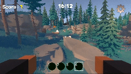 | 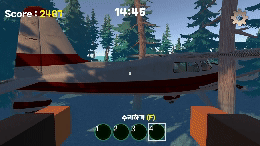 |

## ② 파밍

### **1) 자연물**

| 동물                    | 광물                              | 나무                              |
|-----------------------|---------------------------------|---------------------------------|
| 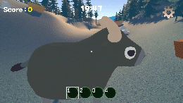 | 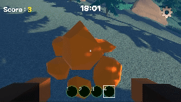 | 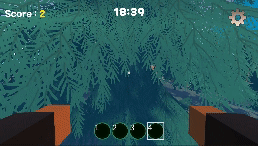 |
| | 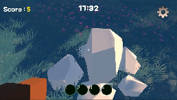   | |
 | | 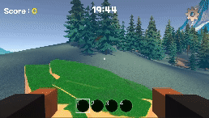   | |

### **2) 인공물**

| 오크통                       | 연료통                           |
|---------------------------|-------------------------------|
| 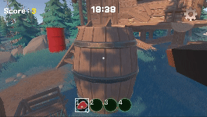 | 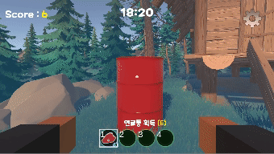 |

## ③ 조합

| 조합 성공                   | 조합 실패                           |
|-------------------------|---------------------------------|
| 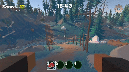 | 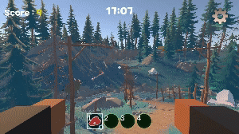 |

## ④ 탈출

| 탈출 성공                       | 탈출 실패                           |
|-----------------------------|---------------------------------|
|  | 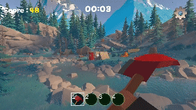 |

# 3️⃣ Web Page

---

| 홈페이지                            | 랭킹 페이지                          |
|---------------------------------|---------------------------------|
| 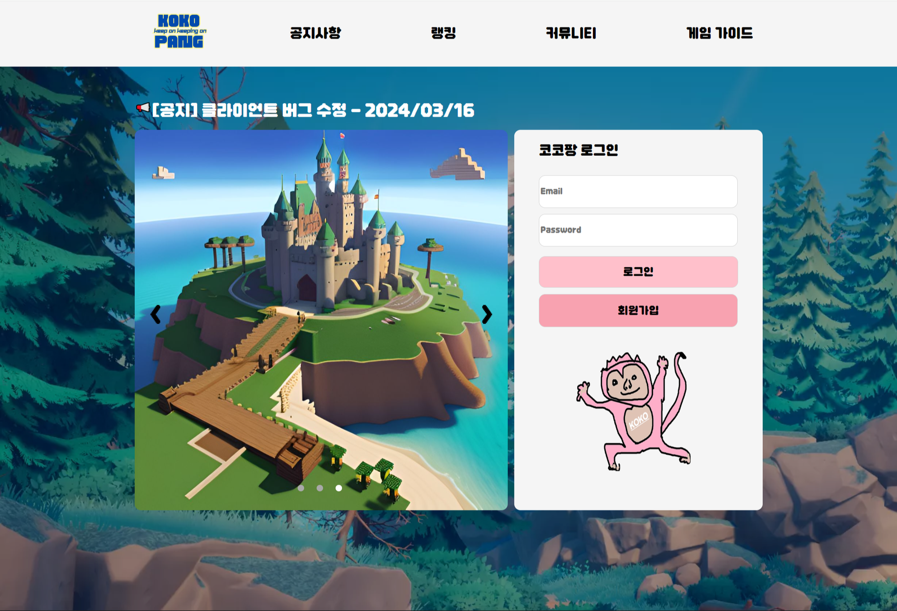 | 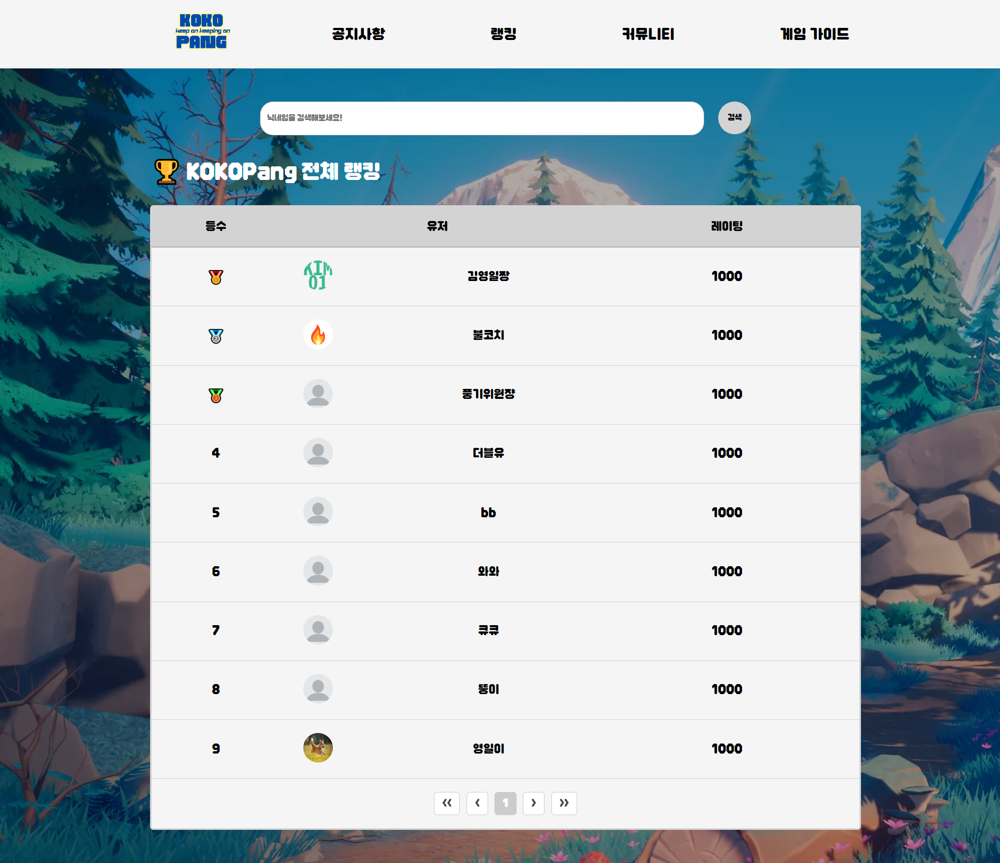 |

# 4️⃣ About the project

---

## 🛠 System Architecture 🛠

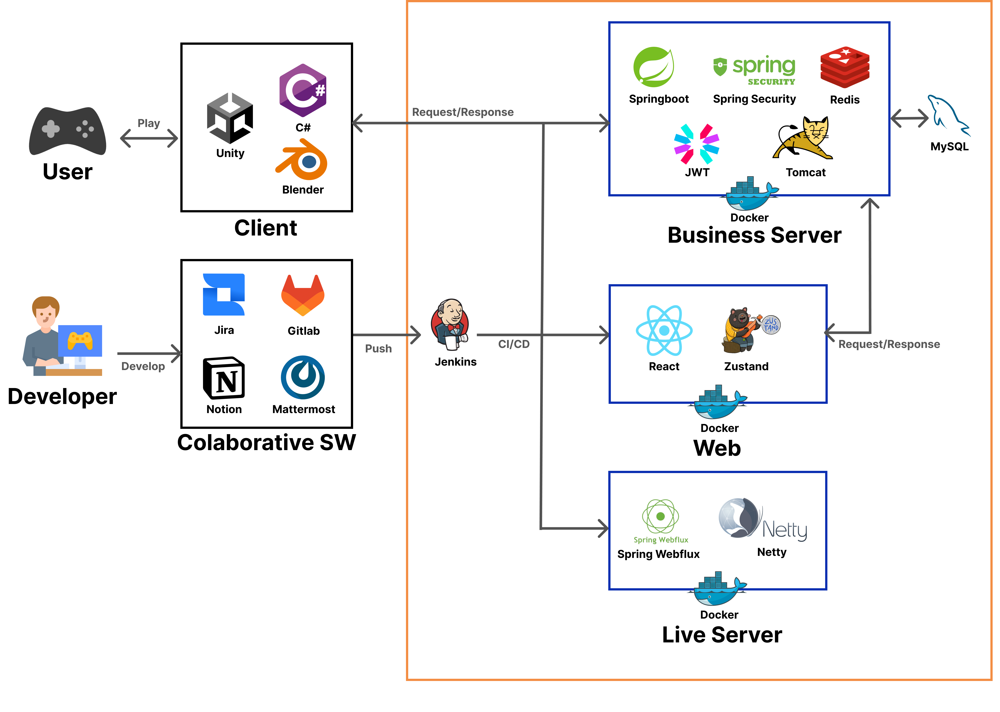

## 🛠 Tech Stack 🛠

1. 이슈 관리 : 
2. 형상 관리 : 
3. 커뮤니케이션 :   
4. 개발 환경
    - Game Engine  : 
    - IDE
        - 
        - 
    - Database :  
    - Server :  

### 📃 상세 사용

- GAME
    - 
    - 
- Asynchronous TCP Server
    - 
    - 
    - 
    - 
    - 
- Data Server
    - 
    - 
    - 
    - 
    -  
- AWS EC2
    - 
    - 
    - 

# 5️⃣ Unity Game Project

## 📌 SCENE PROGRESS

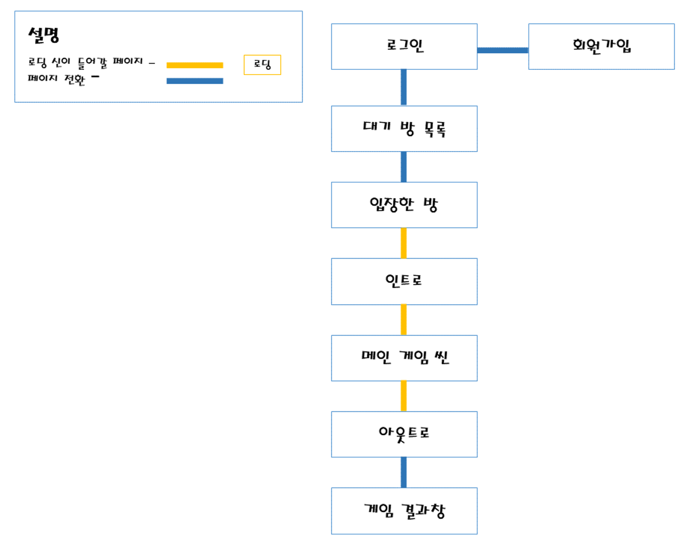
## 📌 구현 내용

### ①  씨네머신(Cinemachine)

- 유니티 씨네머신을 이용한 인트로 아웃트로 영상 촬영

- Virtual Camera와 Dolly Camera 를 이용하여 비행기의 움직임에 따라 카메라의 이동 전환조정
- Look At과 Follow 설정을 이용하여 오브젝트의 움직임에 따른 자연스러운 카메라의 전환 적용

### ② 대기방 목록

- 이미지 에셋을 이용하여 게시판 이미지 생성
- 소켓 통신을 이용하여 게임에 참여한 사람들에 대한 정보 표현
- 같은 소켓을 사용하는 인원들이 채팅을 통해 정보를 주고 받을 수 있도록 설계

- 새로운 방 생성과 다른 방에 참가하는 기능 추가

| 방목록 조회                        | 새로운 방 생성 |
|-------------------------------|----------|
| 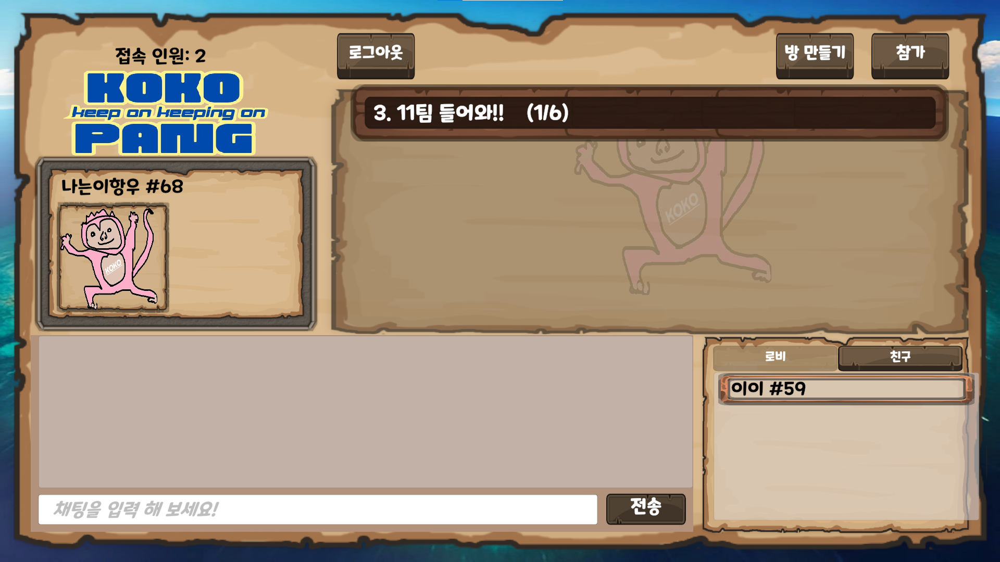 | 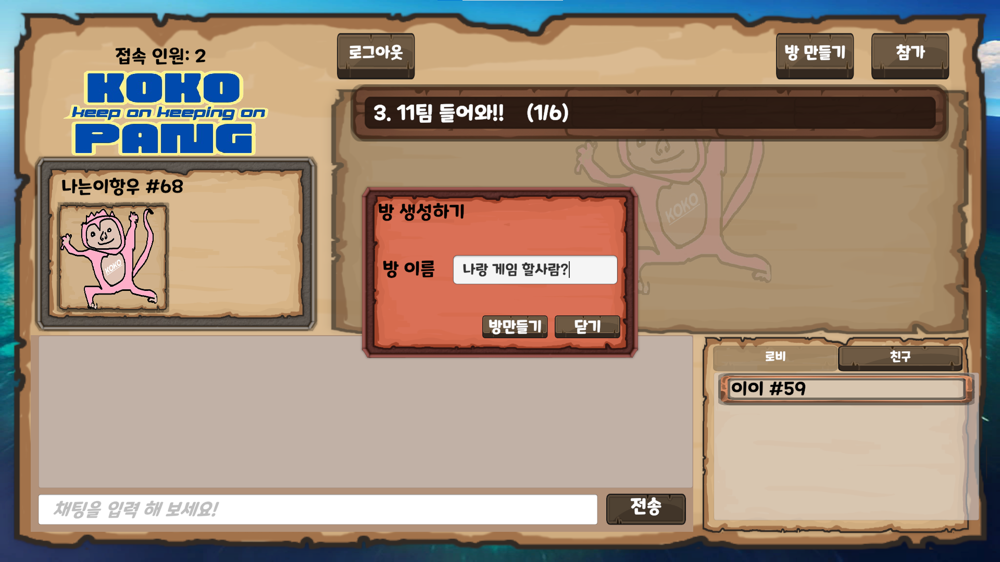         |

### ③ 입장한 방

- 같은 방에 참여한 인원들이 통신을 주고 받을 수 있는 채팅창 구현

- 인게임 정보를 확인할 수 있는 튜토리얼 페이지 제작

| 방 입장                      | 아이템 설명                      | 조작법 설명                        |
|---------------------------|-----------------------------|-------------------------------|
| 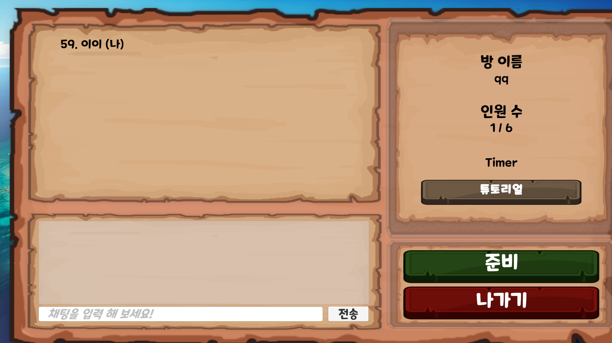 | 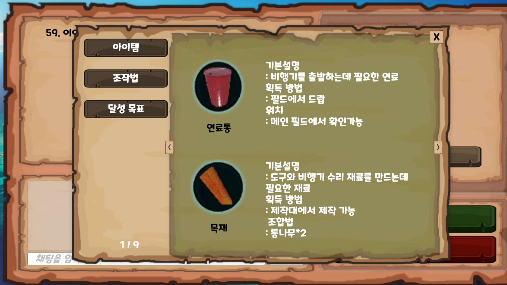 | 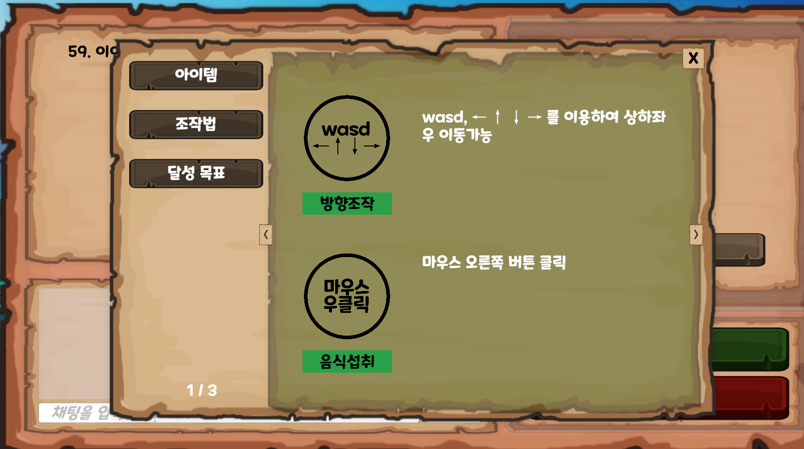 |

### ④ 메인 게임 씬

- ScriptableObject 스크립트를 통해서 아이템 데이터 컨테이너를 저장
- 저장된 아이템 데이터들을 이용하여 아이템 프리팹 생성

  
  | 아이템프리팹                           |
  |-------------------------------|
  | 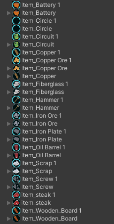

- 오브젝트들에 Collider와 적용과 HP를 적용하여 Attack 을 했을 때 맨손은 HP—; 무기를 들었을 경우 HP -= 2; 로 적용 하여 오브젝트를 파괴하고 파밍

| 오브젝트                        | 오브젝트 파밍                   |
|-----------------------------|---------------------------|
| 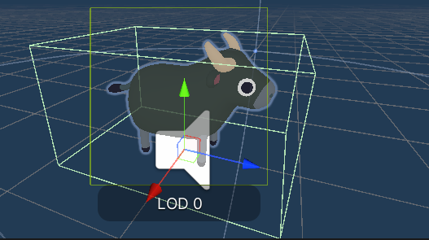 |  |

- 오브젝트들에 Collider와 적용과 HP를 적용하여 Attack 을 했을 때 맨손은 HP—; 무기를 들었을 경우 HP -= 2; 로 적용 하여 오브젝트를 파괴하고 파밍
- 크래프팅, 아이템 등 UI 이미지를 통해 구현 후 Slot transform을 계산하여 범위에 벗어났을 경우 템이 옮겨지지 않도록 구현
- 오브젝트들에 Collider와 적용과 HP를 적용하여 Attack 을 했을 때 맨손은 HP—; 무기를 들었을 경우 HP -= 2; 로 적용 하여 오브젝트를 파괴하고 파밍
- 크래프팅, 아이템 등 UI 이미지를 통해 구현 후 Slot transform을 계산하여 범위에 벗어났을 경우 템이 옮겨지지 않도록 구현

| 조합                      | 오브젝트 획득                   |
|-------------------------|---------------------------|
|  |  |

- 점수 획득 시스템을 통해 점수를 획득하고 아웃트로 씬이 재생되고 결과창을 통해 자신의 점수 확인 가능

### ⑤ 게임결과 창

- 게임에서 얻은 점수를 Score 관련 스크립트를 DontDestroyOnload로 유지하여 결과창에 점수를 띄움
- 유저 별 랭크를 표시하기 위해 게임에서 얻은 점수를 데이터에 PUT 하여 누적 점수를 기록
- 홈페이지를 통해 누적된 랭크를 통해 자신의 순위 확인 가능

| 점수판                           |
|-------------------------------|
| 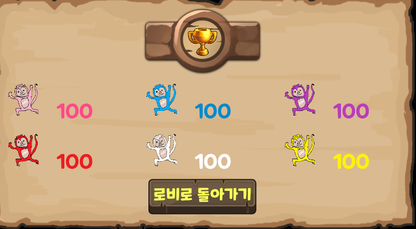 |

### ⑥ 로그인 & 회원가입

- 기본적인 기능을 할 수 있는 로그인 회원가입 페이지 구현
- 중복 검사 및  암호화 구현

| 로그인                       | 로그인 암호화                         | 회원가입                        |  회원가입 암호화 |
|---------------------------|---------------------------------|-----------------------------|---|
| 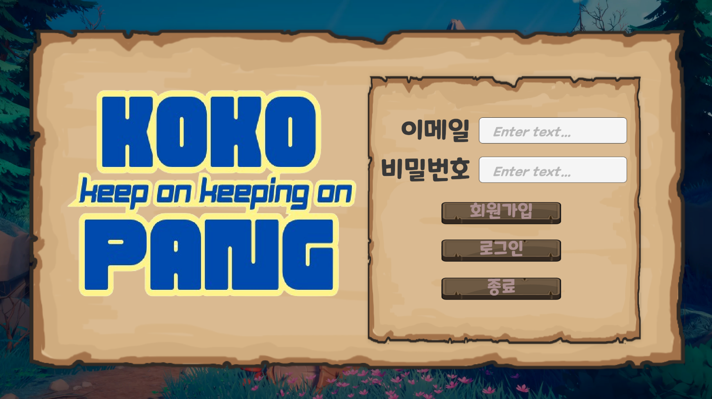 | 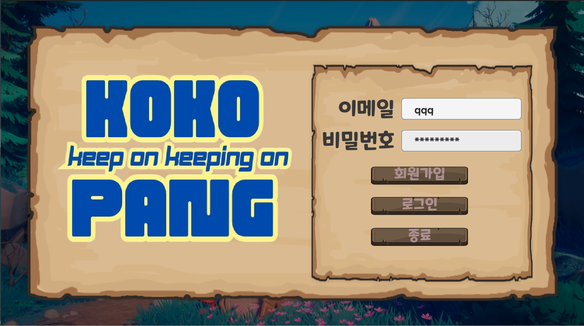 | 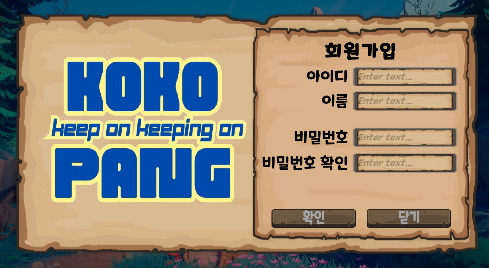 | 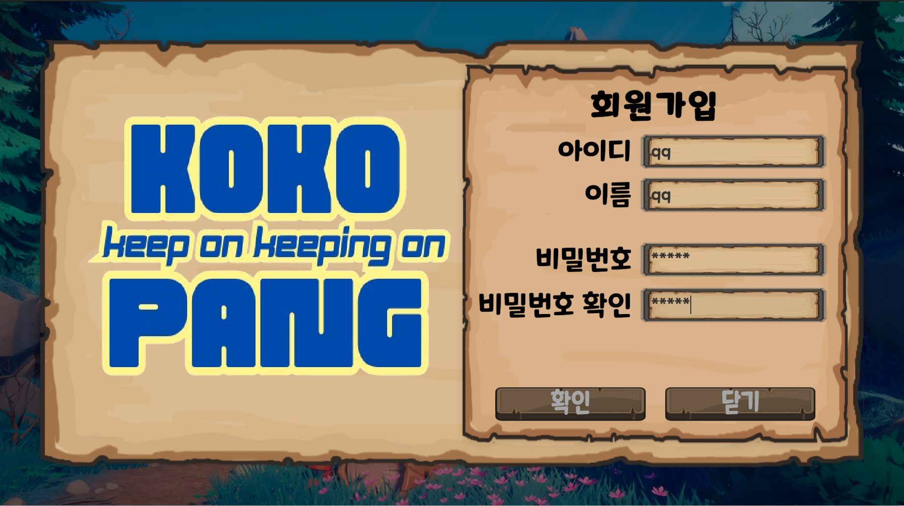

# 6️⃣ Asynchronous TCP Server

---

## 📌 구현 내용

- Reactor Netty 라이브러리 활용
- Reactor Pattern으로 비동기 Non-Blocking TCP 서버 구현
- ChannelPipeline에 Handler 등록
    - LineBasedFrameDecoder
    - 사용자 정의 ChannelHandlerAdapter

| 메서드 | 설명 |
        | --- | --- |
| handlerAdded | client와 최초로 연결되었을 경우|
| handlerRemoved | client와의 연결이 끊겼을 경우 |
| exceptionCaught | 예외 처리|

- Data Stream 처리
    - JSONObject로 처리
    - 분기
        - 기준 key : “channel”
        - 분기 value : “lobby”, “channel”, “ingame”

      | lobby | 1) lobby에 있는 session 목록 관리   2) 생성된 게임 channel 목록 관리    3) lobby 안 client 간 채팅                      |
           | --- |-----------------------------------------------------------------------------------------------------------|
           | channel | 1) 해당 channel에 참가한 session 목록 관리    2) ready 상태 관리     3) client 간 채팅     4) 게임 시작 여부 관리 |
           | ingame | channel 내 session 간 broadcasting      1) 게임 중     - 좌표     2) 게임 종료 후    - 게임 clear 여부    - score |

## 📌 CLIENT-SERVER 데이터 흐름

### ① LOBBY

1. 최초 접속

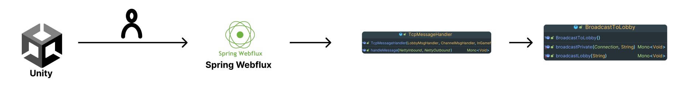

2. 클라이언트로부터 요청

### ② CHANNEL

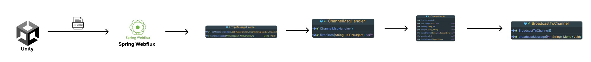

### ③ INGAME

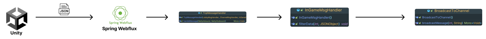

# 7️⃣ Data Server

## 📌 ERD

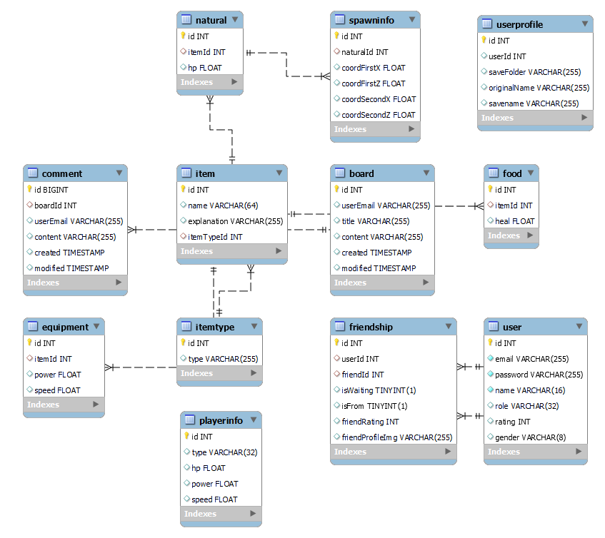

# 8️⃣ 배포

## ① Docker

서로 다른 도커 이미지로 저장되어 있어 각각의 이미지를 실행시킵니다.

필요한 이미지들의 설정은 docker-compose.yml 파일에 작성합니다.

docker 내부는 같은 네트워크로 묶어주기 위해 docker-compose로 실행합니다.

## ② Devops

`Jenkins`로 CI/CD를 구축하여 develop 브랜치에 `merge` 이벤트 발생시 build하도록 구성했습니다.

build 후 docker-compose를 실행하도록 했습니다.

# 9️⃣ About Team KOKO

### 팀원 소개

| 김선욱 `팀장`                                | 강승원                       | 이항우 `PM`                               | 김영일                       | 이주현                       | 장동재                       |
|----------------------------------------|---------------------------|---------------------------------------|---------------------------|---------------------------|---------------------------|
|               |  |              |  |  |  |
| `CLIENT`                               | `CLIENT`                  | `CLIENT` `INFRA`                      | `SERVER`| `SERVER`| `SERVER`|
| [GITHUB](https://github.com/Woogie-Gim) | [GITHUB](https://github.com/kangseungwon0529)                | [GITHUB]() | [GITHUB](https://github.com/012coding) | [GITHUB](https://github.com/LeeeJooo) | [GITHUB](https://github.com/djjang0925) |